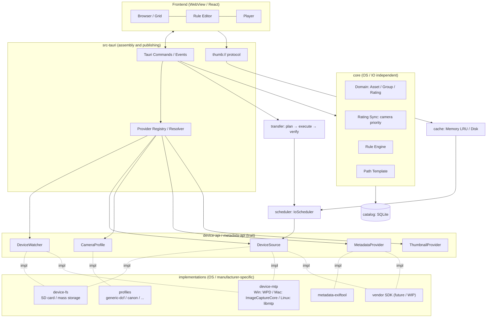
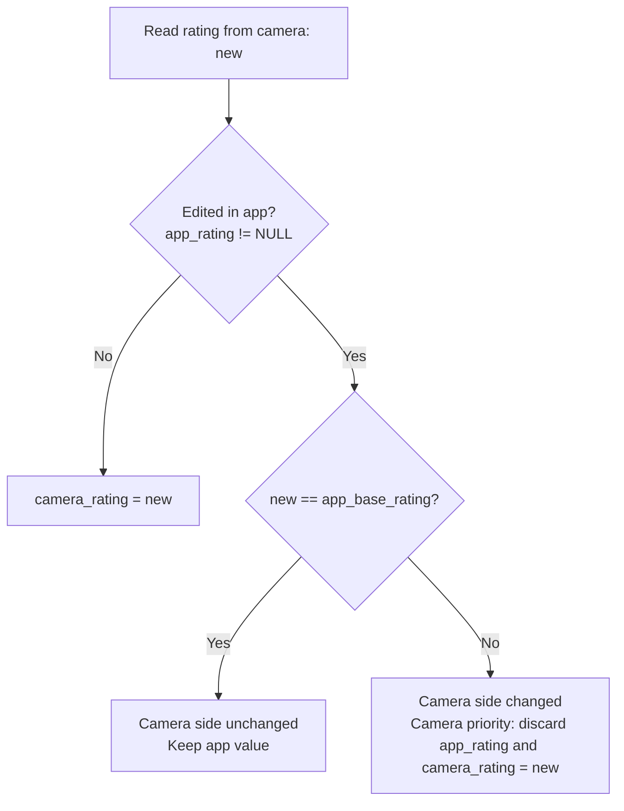
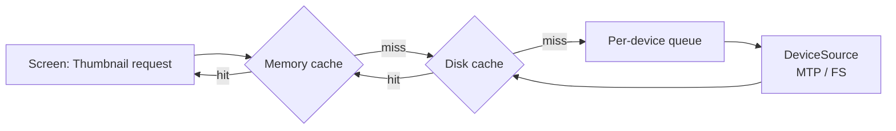

# seiton architecture

> English is the authoritative version. A Japanese translation lives in [docs/ja/architecture.md](ja/architecture.md).

## 1. Purpose

Organize photos and videos from cameras (USB-direct MTP/PTP or SD card readers) with metadata such as ratings while previewing, and import them into any local folder structure based on conditional rules.

- Initial target: Windows, Canon cameras
- Future: macOS, Linux, other manufacturers, feature expansion via manufacturer SDKs

## 2. Requirements

### 2.1 Connection

- Support both USB (MTP/PTP) and SD card readers (mass storage).
- Handle both through a common interface (`DeviceSource`). Differences in capabilities are expressed via `SourceCaps` rather than conditionals, and the UI enables/disables features based on the declaration.
- Automatically detect connections.

### 2.2 Supported Cameras

- Initially Canon (CR3 / CR2 / JPG / HIF / MP4 / MOV / CRM).
- Differences across manufacturers and folder structures are absorbed by `CameraProfile`. Anything within EXIF range can be handled by adding or updating TOML.

### 2.3 Rating (Stars)

- Read EXIF/XMP Rating from files on the camera (try in order of `rating_tags` in the profile).
- Allow rating in the app (stored in SQLite).
- If the camera-side value changes, prioritize the camera and overwrite the app value.
- Never write to the copy source (camera/card). Ratings are reflected only in the copy destination.
  - JPEG / HEIF: Embed in XMP within the file
  - RAW: Create `.xmp` sidecar

### 2.4 Import

- Rules: Save targets per star and type (e.g., 1 star = JPG only, 2 stars = JPG + RAW), separate save destinations per type, path templates for date/time, etc.
- Compute BLAKE3 hash during copy, and verify by re-reading the destination after write. Write to a temporary file then atomic rename.
- No feature to delete original files.
- When a file with the same name exists at the destination (collision policy):
  - `Overwrite` (default): Overwrite. Skip if content is identical
  - `Skip`: Skip
  - `Rename`: Save with a sequence number (`IMG_0001_1.JPG`)
  - Can be changed via options at import time. Plan preview explicitly shows "N overwrites" (due to the risk of overwriting different photos from Canon file number rollover or multiple bodies).
- Record import history in the catalog and display badges on imported assets.

### 2.5 Video

- Do not use ffmpeg (due to licensing, patents, and distribution size).
- Thumbnail acquisition order:
  1. Embedded thumbnail in the file (ExifTool)
  2. Thumbnail returned by the device (MTP `WPD_RESOURCE_THUMBNAIL`)
  3. OS thumbnail functionality (Windows Shell `IShellItemImageFactory`; macOS AVFoundation in the future)
- Playback via WebView `<video>`.
  - SD card: Pass directly via Tauri's asset protocol (`convertFileSrc`)
  - MTP: Download to cache folder then play
  - If playback fails (`<video>` error), open in OS standard application (`tauri-plugin-opener`)

Note: WebView2 can play H.264; HEVC depends on "HEVC Video Extensions" and hardware; CRM (Cinema RAW Light) cannot play.

### 2.6 Performance

- Place a single-worker priority IO scheduler per device (MTP can only process one request at a time).
- Declaratively send the visible range of the screen, and discard old requests.
- Coalesce identical requests.
- Three-tier cache: memory → disk → catalog.

## 3. Decisions and Rationale

| Decision | Rationale |
|---|---|
| Camera (copy source) is read-only | MTP/PTP cannot partially write files, and many cameras do not support `SendObject`. Rewriting requires full resend, with the risk of losing the only data on disconnection |
| Rating conflicts prioritize the camera | The rating assigned by the shooter on the spot is considered correct |
| Do not use manufacturer SDKs initially | Implement generically via MTP/PTP + ExifTool with expansion to other manufacturers in mind. Prepare only extension points for SDKs (WIP) |
| Do not use ffmpeg | Thumbnails can be obtained from embedded/device/OS; playback can be left to WebView. Avoid LGPL compliance and H.264/HEVC patent issues |
| Asset identification key = body serial + capture time (down to SubSec) + base name | MTP Object ID changes per connection. File size can change due to rating changes on camera, so it is not included in the key |
| Read only part of the file header | EXIF/XMP and embedded thumbnails (JPEG APP1, CR3 THMB) are usually near the file header, and both can be retrieved in a single read |
| ExifTool runs resident with `-stay_open` | Avoid per-file startup cost. For MTP, pass the read header bytes via stdin |
| Extensions are built into the main body (Cargo feature) + runtime TOML loading | Dynamic plugins are not adopted due to lack of a stable Rust ABI. If accepting third-party extensions becomes necessary, consider WASM |
| Manufacturer SDKs are runtime-loaded via DLL-only `libloading` | Prepare for cases where SDK distribution conditions prevent bundling. Works via EXIF even without the DLL |
| UI is React + TypeScript + React Aria Components | Ecosystem and information availability. Components use React Aria (headless components with no visual styling) to handle behavior, keyboard interaction, accessibility, and internationalization, while styling is defined via custom CSS |

## 4. Overall Architecture



### 4.1 Extension Axes and Responsible Components

| Extension Axis | Responsible Component | Approach |
|---|---|---|
| Read method (ExifTool → manufacturer SDK) | `MetadataProvider`, `ThumbnailProvider` | Register multiple with priority, select by capabilities |
| Connection method (USB / SD card) | `DeviceSource` | Abstracted as "list" and "range read". Upper layers are unaware of connection method |
| Supported cameras | `CameraProfile` + Resolver | Defined by data (TOML). If none matches, use `generic-dcf` |
| Folder structure | `CameraProfile` | Scan roots, extension types, pair creation method, ignore patterns |
| OS | `cfg(target_os)` in adapters | core / catalog / transfer are OS-independent |

A manufacturer SDK can implement both `DeviceSource` and `MetadataProvider` in a single implementation.

### 4.2 Crate Structure

```
crates/
  core/              Domain (Asset/Group/Rating), rating sync, rule engine, path template (no IO)
  catalog/           SQLite (rusqlite), migrations
  device-api/        DeviceWatcher / DeviceSource / SourceCaps / DeviceInfo / DeviceEvent
  device-fs/         Mass storage implementation + volume monitoring (OS-specific cfg)
  device-mtp/        windows: WPD / macos: ImageCaptureCore (future) / linux: libmtp (future)
  profiles/          CameraProfile + TOML loader (generic-dcf, canon) + Resolver
  metadata-api/      MetadataProvider / ThumbnailProvider / MetaCaps
  metadata-exiftool/ ExifTool resident process implementation
  scheduler/         IoScheduler (priority / epoch / coalescing)
  cache/             Memory LRU + disk cache
  transfer/          Plan (dry-run) → execute → verify, XMP writing
src-tauri/           Provider Registry / Resolver assembly, Tauri commands/events, thumb:// protocol
ui/                  React + TypeScript
profiles/            Bundled profile TOML
```

## 5. Main Interfaces

The following is a design sketch and will be adjusted during implementation.

```rust
// ---- device-api ----
bitflags::bitflags! {
    /// Declares per connected device what it can do
    pub struct SourceCaps: u32 {
        const RANGE_READ   = 1 << 0; // Can read bytes in a specified range
        const DEVICE_THUMB = 1 << 1; // Can retrieve thumbnail from device
        const LOCAL_PATH   = 1 << 2; // Can handle directly by file path (SD card)
    }
}

pub enum Transport { Mtp, MassStorage, Vendor(&'static str) }

pub struct DeviceInfo {
    pub id: DeviceId,           // ID valid only while connected
    pub transport: Transport,
    pub vendor: Option<String>, // USB VID, MTP Manufacturer, etc.
    pub model: Option<String>,
    pub serial: Option<String>,
}

pub enum DeviceEvent { Attached(DeviceInfo), Detached(DeviceId) }

pub trait DeviceWatcher: Send + Sync {
    fn subscribe(&self) -> tokio::sync::mpsc::Receiver<DeviceEvent>;
}

pub trait DeviceSource: Send + Sync {
    fn info(&self) -> &DeviceInfo;
    fn caps(&self) -> SourceCaps;
    /// Enumerate files and folders in device virtual paths
    fn list(&self, dir: &VPath) -> Result<Vec<Entry>>;
    fn read_range(&self, obj: &ObjRef, offset: u64, len: u64) -> Result<Bytes>;
    fn open_stream(&self, obj: &ObjRef) -> Result<Box<dyn Read + Send>>;
    fn device_thumbnail(&self, _obj: &ObjRef) -> Result<Option<Bytes>> { Ok(None) }
    fn local_path(&self, _obj: &ObjRef) -> Option<PathBuf> { None }
}

// ---- profiles ----
pub enum MediaKind { Raw, Jpeg, Heif, Video, Sidecar }

pub trait CameraProfile: Send + Sync {
    fn id(&self) -> &str;                                   // "canon", "generic-dcf"
    fn score(&self, dev: &DeviceInfo, probe: &Probe) -> u8; // 0 = unsupported. Higher is higher priority
    fn scan_roots(&self) -> &[VPattern];                    // e.g.: DCIM/*
    fn classify(&self, e: &Entry) -> Option<MediaKind>;
    fn group_key(&self, e: &Entry) -> GroupKey;             // Key to create RAW+JPEG pairs
}

// ---- metadata-api ----
pub struct MetaCaps { pub rating_read: bool, pub rating_write: bool, pub thumb: bool }

pub trait MetadataProvider: Send + Sync {
    fn caps(&self, kind: MediaKind) -> MetaCaps;
    /// Receives DeviceSource so only necessary parts can be read
    fn read(&self, src: &dyn DeviceSource, obj: &ObjRef, kind: MediaKind) -> Result<AssetMeta>;
}

// ---- scheduler ----
pub enum Priority { Interactive = 0, Prefetch = 1, Transfer = 2, Background = 3 }

pub trait IoScheduler {
    /// Replace visible and prefetch targets together (old epoch P0/P1 become invalid).
    /// `view` is the ID per window/panel (§9.1)
    fn set_viewport(&self, view: ViewId, epoch: u64, visible: Vec<AssetKey>, prefetch: Vec<AssetKey>);
    fn close_viewport(&self, view: ViewId);
    async fn request(&self, key: JobKey, pri: Priority) -> Result<Bytes>;
}
```

`AssetMeta` includes body serial, capture time (DateTimeOriginal + SubSecTimeOriginal), rating, maker, model name, etc. The asset identification key is derived from this.

## 6. Camera Profiles

In addition to bundled TOML, TOMLs in the user folder are also loaded at runtime (same `id` is overwritten by the user side). Include `schema_version` and validate on load.

```toml
# profiles/canon.toml
schema_version = 1
id = "canon"
extends = "generic-dcf"

[match]
usb_vendor_id    = [0x04A9]
exif_make        = ["Canon"]
folder_signature = ["DCIM/*CANON", "CANONMSC"]

[layout]
scan_roots = ["DCIM/*"]
ignore     = ["CANONMSC/**", "MISC/**"]

[kinds]
raw   = ["CR3", "CR2"]
jpeg  = ["JPG"]
heif  = ["HIF"]
video = ["MP4", "MOV", "CRM"]

[metadata]
# Which tags to read rating from (try in order from top)
rating_tags = ["XMP:Rating", "Canon:Rating", "EXIF:Rating"]
```

Resolution (Resolver) order: USB/MTP information (VID, etc.) → folder structure → EXIF Make. SD cards lack USB information, so use the latter two. If none match, use `generic-dcf`.

Implementation notes (Task 2):

- Score: USB VID match +100, EXIF Make (or MTP manufacturer name) prefix match +80, `folder_signature` match +50. Profiles with `fallback = true` always score 1. Adopt the highest score; ties go to the one earlier by id order.
- Inheritance: Use parent values from `extends` for fields omitted in child (lists are replaced, not appended). `match.fallback` is not inherited.
- User profiles: `<app settings folder>/profiles/*.toml`. Overwrites bundled profiles with the same id. If the overridden definition is invalid, show a warning and use the bundled definition.
- Validation: id format, required `scan_roots`, glob validity, no references outside roots (`..`), extension format, do not register the same extension in multiple types.
- Grouping: Treat files in the same folder with the same base name (case-insensitive) as a single shot.

Cases that cannot be handled by TOML alone:

| Case | Handling |
|---|---|
| New RAW formats unsupported by ExifTool | Update bundled ExifTool |
| Special video structures (e.g., Sony `PRIVATE/M4ROOT` and separate XML files) | If pair creation can be expressed, use TOML; otherwise, code |
| Manufacturer SDK / PTP vendor extensions | Code (`DeviceSource` / `MetadataProvider` implementation) |

## 7. Catalog (SQLite)

```sql
CREATE TABLE asset (
  id               INTEGER PRIMARY KEY,
  body_serial      TEXT NOT NULL,
  capture_time     TEXT NOT NULL,   -- DateTimeOriginal + SubSec
  base_name        TEXT NOT NULL,   -- IMG_1234
  camera_rating    INTEGER,         -- Last read camera-side value
  camera_seen_at   TEXT,
  app_rating       INTEGER,         -- Value assigned in app (NULL = unedited)
  app_base_rating  INTEGER,         -- Camera-side value at time of app edit
  app_updated_at   TEXT,
  conflict         INTEGER NOT NULL DEFAULT 0,
  UNIQUE (body_serial, capture_time, base_name)
);
-- Effective rating = COALESCE(app_rating, camera_rating)
```

Tables for import history, files (entities such as RAW / JPEG belonging to assets), and cache management will be added at implementation time.

### 7.1 Rating Sync (Camera Priority)



If RAW + JPEG pair ratings differ, adopt the higher one (to be verified and confirmed at implementation time).

## 8. IO Scheduler and Cache

### 8.1 Read Flow



### 8.2 Priority

| Priority | Use | Cancellation |
|---|---|---|
| P0 Interactive | Thumbnails for visible items, zoomed preview, video download | Discard when screen changes |
| P1 Prefetch | Slightly ahead of visible range | Discard when screen changes |
| P2 Transfer | Copy | Only when user explicitly stops |
| P3 Background | Read ratings for all files, create index | Do not discard (only delay) |

- The screen sends visible and prefetch targets together (`set_viewport`, approximately 100ms after scrolling settles). Increment epoch on each send.
- To support multiple windows, the visible range is held per window (panel): `set_viewport(view_id, epoch, visible, prefetch)`. Epoch is also per-window; P0/P1 targets are the union of visible ranges across all windows. When a window closes, remove its visible range (§9.1).
- The scheduler discards P0/P1 of old epochs on dequeue. Running small tasks are not stopped and are placed into cache.
- Large reads (copy) are split into ~4–8MB chunks, allowing P0 to interleave between chunks.
- Requests with the same key (asset + type + size) are coalesced, returning to all waiters on completion.

### 8.3 Cache

| Layer | Content | Limit / Deletion |
|---|---|---|
| Memory (LRU) | Recently displayed thumbnails | A few hundred MB. Delete oldest first |
| Disk `app_cache_dir/thumbs/` | Thumbnails, zoomed previews. Management info in SQLite | Configurable limit, delete oldest first, manual full delete |
| Disk `app_cache_dir/video/` | Videos downloaded for MTP playback | Small limit, delete on exit |
| Catalog (SQLite) | Metadata and ratings | Persistent |

Cache key = asset identification key + source size + modified date. When rating changes on camera, the file is rewritten and naturally re-read.

## 9. UI

- Images are loaded via a custom URL (`thumb://<assetId>?s=256`). The handler fetches from cache → scheduler in order.
- Thumbnail grid uses React Aria `GridList` + `Virtualizer` (`GridLayout`) for virtualization (assume thousands of actual cards).
- Derive visible range from Virtualizer's visible range (or `IntersectionObserver`) and call `set_viewport`. Since WebView-side image load cancellation may not propagate to the protocol handler, cancellation is via `set_viewport`.
- UI ⇔ Rust DTOs are defined on the Rust side, and TypeScript types are generated via ts-rs or specta.
- For development, have a mode that returns mock data via `@tauri-apps/api/mocks` (`mockIPC`) (`VITE_USE_MOCK`).
- Keyboard interaction and accessibility are handled by React Aria Components.

Implementation notes (Task 3):

- DTO (`src-tauri/src/dto.rs`): `DeviceView`, `AssetView`, `FileView`, `RatingUpdate`, `RatingSource`, `TransportView`, `FolderScan`, `GroupView`. `MediaKind` is generated by `seiton-core`'s `ts` feature. `u64` defaults to `bigint` in ts-rs, so `number` is specified.
- Commands (UI-side `ui/src/api.ts`): `list_devices`, `list_assets(deviceId)`, `set_rating(update)`, `get_thumbnail(assetId)`. Currently only mock backend (`ui/src/mock/`) is implemented; Rust-side implementation will be added in Tasks 4–7. Until then, normal launch (`npm run tauri dev`) shows the folder list from Task 2.
- Grid uses React Aria `GridList` (`layout="grid"`, `selectionBehavior="replace"`). Navigation via arrow/Home/End/PageUp/PageDown and selection via click/Ctrl+⌘+click/Shift+click/Space/Ctrl+A are handled by React Aria. seiton only adds rating via 0–5 (0 clears).
- Stars in grid cells are clickable (that cell only; selection unchanged. Pressing the current rating star again clears). Stars are gauge-style; hovering over ★3 lights ★1–★3 (Preview rating same). Star buttons are not Tab targets (keyboard rating uses 0–5 on the focused cell).
- Rating 0 and unset (`null`) are both treated as "unrated".
- Components use React Aria Components (`Button`, `Select`, `CheckboxGroup` / `Checkbox`, `RadioGroup`, `ListBox`, `ModalOverlay` / `Modal` / `Dialog`, `ProgressBar`, `TextField`, `Tooltip`, `GridList` / `Virtualizer`). Common thin wrappers are in `ui/src/controls.tsx`. Only the split boundary (`SplitView`) not in React Aria is custom (WAI-ARIA window splitter).
- React Aria Checkbox / Radio have an invisible `<input>` in absolute position, so the label side has `position: relative` (without this, clicking scrolls the entire window. Verified in E2E tests).
- Thumbnails are cached in memory via TanStack Query (Tasks 6/7 will replace with `thumb://` and disk cache).
- Internationalization (`ui/src/i18n.tsx`): Labels (headings, buttons, item names, options, panel names) are in English regardless of language. Supplementary text (hints, descriptions, empty states, errors, status) follows language setting, English or Japanese. Toggle via Language in header, saved to `localStorage`. Default is system language (Japanese → `ja`). Can also specify via `?lang=ja` (for confirmation). React Aria's own strings and number/date formats also follow the same language (`I18nProvider`).
- Visual design: See `PRODUCT.md` (product premises) and `.impeccable/surfaces/ui-src.md` (directional contract). "Contact sheet on a bright light table" chosen via impeccable skill (`.kiro/skills/impeccable/`). Colors: white paper, gray base, near-black ink; red is used only for marks (stars, selection, Import button).
- Tests: Vitest + Testing Library (jsdom, `ui/src/**/*.test.tsx`) and Playwright E2E (actual Chromium, `e2e/`, §9.3).

### 9.1 Split Views and Multiple Windows (Task 3.1)

The screen is composed of "panels". There are three panel types.

| Type | Display Name | Content |
|---|---|---|
| `thumbnails` | Thumbnails | Filters + thumbnail grid |
| `preview` | Preview | Preview + details + rating |
| `import` | Import Settings | Import default settings (§9.2) |

- Each panel exists only once in the app, with state being "main window", "separate window", or "hidden". Do not support opening multiple windows of the same type (to avoid confusion). External window labels are fixed per type (`pane-thumbnails` / `pane-preview` / `pane-import`); if already open, just bring it to front.
- Main window layout (positions are fixed):
  - Left: Devices and Windows (status and actions for each panel). The sidebar can be hidden with the button at the left of the status bar or Ctrl/⌘+B; the choice is remembered, and the panes take the freed width
  - Center: Left column Thumbnails, right column Preview (top) and Import Settings (bottom) stacked vertically. If either is separate window/hidden, the remaining one uses the entire right column
  - Bottom: Status bar (sidebar toggle and import progress on the left, Import button on the right)
  - Boundaries are adjustable via drag and arrow keys (WAI-ARIA window splitter), and ratios are saved per split
- Icon at top-right of panel: Open in separate window / close (hide). The last panel remaining in main cannot be moved or hidden. Icon buttons have `aria-label` and tooltips.
- Ways to return an external window to main:
  - Drag the external window itself (title bar) and release over the main window (including surrounding 32px). While overlapping, the main window shows "Release to return"
  - Close the external window (panel does not disappear; returns to main)
  - Icon on external window, or icon in Windows list
- Window drag-and-drop docking detection (`ui/src/windowing/docking.ts`):
  - The external window monitors its own movement (Tauri: `onMoved`, browser: position polling). Detection uses the center point of the external window's title bar (approximation of pointer position during drag). Merely placing next to the main window does not dock
  - Since OS title bar drag has no "released" event, treat as released if movement stops for 500ms while overlapping
  - To avoid docking immediately after opening while overlapping the main window, do not detect until the window moves outside the main window once. External windows open to the right of the main window (within monitor bounds)
  - Coordinates are physical pixels in Tauri (same units for both windows)
- Closing the main window closes all external windows (implemented in both Rust `on_window_event` and browser `pagehide`).
- Window labels: main is `main`, external is `pane-*`. `capabilities/default.json` targets these two, allowing window creation (`core:webview:allow-create-webview-window`), `close`, and `set_focus` from the screen (position/size/monitor retrieval is in `core:default`). External windows open via `index.html?pane=<kind>`.

Since each window has a separate JavaScript execution context (React state, TanStack Query cache), synchronization is as follows.

| Information | Owner | Sync Method |
|---|---|---|
| Assets (ratings, etc.) | Backend (Rust / mock) | Changed backend sends `assetsUpdated` to all windows; each window updates cache |
| Selected device, selection, focused asset | Shared across all windows (`SharedState`) | Changed window sends `state`. New window sends `stateRequest`; main returns current state |
| Import settings | Backend | Saved backend sends `importSettingsUpdated` |
| Import progress | Backend | Running backend sends `importProgress` |
| Filters, scroll position, split ratios | Per panel/window | No sync |

Inter-window messaging is abstracted via `Bus` interface (`ui/src/windowing/bus.ts`).

- Tauri: Event `seitin://bus` (`emit` / `listen`). Rust side also sends `assetsUpdated` on the same channel (Task 5+)
- Browser (`npm run dev:mock`): `BroadcastChannel`. Windows are `window.open` popups
- Tests: In-process hub (draw multiple windows in a single document for verification)

Window creation is abstracted via `WindowHost` interface (`ui/src/windowing/host.ts`) (Tauri's `WebviewWindow` / browser popup / test). All implementations guarantee "one window per type".

In mock mode, only seiton commands are replaced with mocks (`setBackendOverride`), while Tauri APIs (window, events, dialogs) are real. Thus `npm run tauri:mock` can test real multiple windows with mock data. Mock ratings are saved in `localStorage` so each window's mock sees the same values.

### 9.2 Import Settings and Import (Task 3.1, mock stage)

Edit default settings in the Import Settings panel, and import via the Import button in the status bar. Settings are saved on each change and shared across all windows (DTO: `ImportSettings`).

- Save formats: "Apply same settings to all" or "Set individually per star" (6 items: unrated, ★1–★5). Formats: "RAW only", "JPG + RAW", "JPG only". HEIF is treated same as JPG (developed image). If a shot has no files in the specified format (e.g., JPG-only setting but only RAW exists), nothing is copied.
- Destination folder: Text input and "Browse..." (Tauri folder selection dialog; disabled in browser mock).
- Destination folder structure:
  - Simple settings: Checkboxes for date (`{yyyy}-{MM}-{dd}`), time (`{HH}`), star (`star{star}`), and separate RAW/JPG folders (`{file}`). Nested in this order
  - Advanced settings: Enter template directly. Switching from simple settings inherits the current structure as a template
  - File names remain the same as on the card (template is for folders only)
- Template syntax (`ui/src/importing/template.ts`):
  - `/` separates folders. Variables in curly braces: `{yyyy}` `{yy}` `{MM}` `{dd}` `{HH}` `{mm}` `{ss}` `{star}` (0–5, unrated is 0) `{file}` (RAW / JPG / HEIF / VIDEO / META)
  - Curly braces are used because notations like `yymmdd` cannot distinguish from folder name characters (e.g., `mm`)
  - Validation: Unknown variables, unclosed `{`, unmatched `}`, characters invalid on Windows (`<>:"\\|?*`, control chars), `\\` (separator is `/`), `.` / `..`, trailing `.` or space
  - If capture time is unknown, date/time variables become `unknown`
  - Path separator follows the destination notation (e.g., `D:\\Photos` → `\\`)
- Import dialog: Checkboxes for rating (All / Unrated / ★1–★5) and media format (All / Images / Videos / Metadata). "All" toggles with individual items; selecting some shows intermediate state. Display count of items, files, and size; show reasons start is not possible (no destination, template error, nothing selected, in progress, etc.). Esc closes; Tab cycles within dialog. Targets all assets in the selected device.
- Metadata: `MediaKind::Sidecar` (XMP, Sony XML etc. in future). Regardless of image save format settings, metadata is copied when selected.
- Progress: Progress bar, file count, percentage, current file name in status bar left. During execution, show cancel button; after completion/cancel, show dismiss button. Completed assets get an "Imported" badge.
- Commands (mock only, Rust in Tasks 9–10): `get_import_settings`, `set_import_settings`, `start_import(request)`, `cancel_import(jobId)`, `get_import_status`.
- Import plan calculation (which files to copy where) and templates are implemented in TypeScript at the mock stage. In Task 9, move to Rust (`seiton-core`) and have the screen call a plan preview command (no dual implementation).

### 9.3 E2E Tests (Playwright)

- `npm run e2e` launches browser mock (`npm run dev:mock`, port 1430) via Playwright and tests in actual Chromium. Can verify layout, focus, and scroll that jsdom cannot.
- `?mock=fast` removes mock delays.
- Targets: grid/selection/rating, filters, language, import dialog and progress, separate windows (browser popups), no window scroll on click.
- Real Tauri app is out of scope (macOS WKWebView cannot be controlled by Playwright). On Windows, consider `connectOverCDP` via WebView2 debug port in Tasks 11–12.
- AI agents can operate and observe the screen via Playwright MCP (`.kiro/settings/mcp.json`). See [AGENTS.md](../AGENTS.md) for usage.

## 10. Preliminary Verification (Spike)

Conduct at the beginning of the relevant task and append results to this section.

| Item | Task | Result |
|---|---|---|
| Rating tag storage location per Canon model (XMP:Rating / Canon:Rating / EXIF:Rating) | Task 4 | Not conducted |
| Header bytes needed for metadata/thumbnail retrieval in CR3 / MP4 | Task 4 | Not conducted |
| Presence of embedded thumbnails in MP4 / MOV | Task 4 | Not conducted |
| Feasibility of partial read via WPD (IStream Seek / MTP GetPartialObject) | Task 11 | Not conducted |
| Playback feasibility of Canon HEVC 10bit / LPCM audio video in WebView2 | Task 8 | Not conducted |

## 11. Licenses and Bundled Components

- seiton itself: MIT
- ExifTool (Artistic License / GPL dual): Bundled as a separate process, displayed in third-party license notice screen
- ffmpeg: Not bundled. If needed in the future, add LGPL build as a separate process

## 12. Out of Scope (Future)

- macOS: ImageCaptureCore, volume monitoring, thumbnails via AVFoundation
- Linux: libmtp
- Manufacturer SDK implementations (Canon EDSDK, etc., WIP)
- Writing ratings back to camera (copy source)
- Deletion of original files
