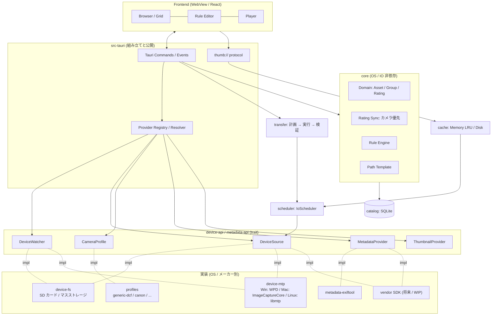
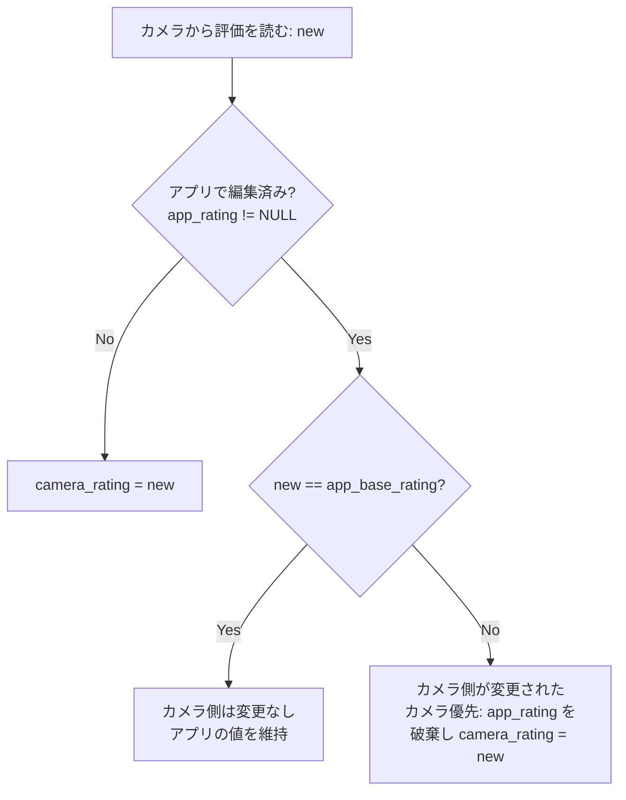
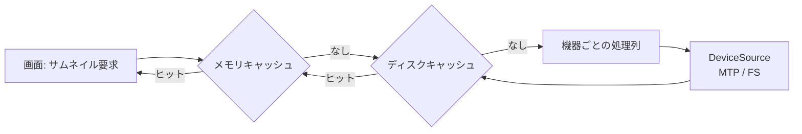

# seiton 設計書

## 1. 目的

カメラ（USB 直結の MTP/PTP、または SD カードリーダー）内の写真・動画を、プレビューを見ながら星評価などのメタデータで整理し、条件ルールに従ってローカルの任意のフォルダ構成へ取り込む。

- 初期ターゲット: Windows、Canon のカメラ
- 将来: macOS、Linux、他メーカー、メーカー SDK による機能拡充

## 2. 要件

### 2.1 接続

- USB（MTP/PTP）と SD カードリーダー（マスストレージ）の両方に対応する。
- どちらも共通のインターフェース（`DeviceSource`）で扱う。機能の差は条件分岐ではなくケイパビリティ（`SourceCaps`）で表現し、UI は申告に応じて機能を有効/無効にする。
- 接続を自動で検知する。

### 2.2 対応カメラ

- 初期は Canon（CR3 / CR2 / JPG / HIF / MP4 / MOV / CRM）。
- メーカーやフォルダ構成の違いは `CameraProfile` で吸収する。EXIF で扱える範囲なら TOML の追加・更新だけで対応できる。

### 2.3 評価（星）

- カメラ内のファイルの EXIF/XMP Rating を読む（プロファイルの `rating_tags` の順に試す）。
- アプリでも評価を付けられる（SQLite に保存）。
- カメラ側の値が変わっていたら、カメラを優先してアプリの値を上書きする。
- コピー元（カメラ/カード）には一切書き込まない。評価はコピー先にだけ反映する。
  - JPEG / HEIF: ファイル内の XMP に埋め込む
  - RAW: `.xmp` サイドカーを作る

### 2.4 取り込み

- ルール: 星と種類ごとの保存対象（例: 星1 = JPG のみ、星2 = JPG + RAW）、種類ごとに別の保存先、日付・時間などのパステンプレート。
- コピー中に BLAKE3 ハッシュを計算し、書き込み後にコピー先を読み直して検証する。一時ファイルに書いてから atomic rename する。
- 元ファイルの削除機能は持たない。
- 同じ名前のファイルがコピー先にある場合（衝突ポリシー）:
  - `Overwrite`（デフォルト）: 上書きする。ただし中身が同じならスキップする
  - `Skip`: スキップする
  - `Rename`: 連番を付けて保存する（`IMG_0001_1.JPG`）
  - 取り込み時のオプションで変更できる。計画プレビューに「上書き N 件」を明示する（Canon のファイル番号の巻き戻りや複数ボディで別の写真を上書きするリスクがあるため）。
- 取り込み履歴をカタログに記録し、取り込み済みの資産にバッジを表示する。

### 2.5 動画

- ffmpeg は使わない（ライセンス・特許・配布サイズの理由）。
- サムネイルの取得順:
  1. ファイルの埋め込みサムネイル（ExifTool）
  2. デバイスが返すサムネイル（MTP の `WPD_RESOURCE_THUMBNAIL`）
  3. OS のサムネイル機能（Windows Shell `IShellItemImageFactory`、将来 macOS は AVFoundation）
- 再生は WebView の `<video>`。
  - SD カード: Tauri の asset protocol（`convertFileSrc`）で直接渡す
  - MTP: キャッシュフォルダへダウンロードしてから再生する
  - 再生できない場合（`<video>` のエラー）は OS 標準アプリで開く（`tauri-plugin-opener`）

参考: WebView2 では H.264 は再生可能、HEVC は「HEVC ビデオ拡張機能」とハードウェア次第、CRM（Cinema RAW Light）は再生不可。

### 2.6 性能

- 機器ごとに単一ワーカーの優先度付き IO スケジューラを置く（MTP は同時に 1 要求しか処理できないため）。
- 画面の表示範囲を宣言的に送り、古い要求は捨てる。
- 同じ要求はまとめる（coalescing）。
- メモリ → ディスク → カタログの 3 段キャッシュ。

## 3. 決定事項と理由

| 決定 | 理由 |
|---|---|
| カメラ（コピー元）は読み取り専用 | MTP/PTP はファイルの部分書き込みができず、`SendObject` に対応しないカメラが多い。書き換えには丸ごとの再送が必要で、切断時に唯一のデータを失うリスクがある |
| 評価の競合はカメラ優先 | 撮影者がその場で付けた評価を正とする |
| 初期はメーカー SDK を使わない | 他メーカーへの展開を考え、MTP/PTP + ExifTool で汎用的に実装する。SDK は拡張ポイントだけ用意する（WIP） |
| ffmpeg を使わない | サムネイルは埋め込み/デバイス/OS から取得、再生は WebView に任せられる。LGPL 対応と H.264/HEVC 特許の問題を避ける |
| 資産識別キー = ボディシリアル + 撮影日時（SubSec まで）+ ベース名 | MTP の Object ID は接続ごとに変わる。ファイルサイズはカメラでの評価変更で変わるためキーに含めない |
| ファイル先頭の一部だけを読む | EXIF/XMP と埋め込みサムネイル（JPEG APP1、CR3 THMB）は通常ファイル先頭付近にあり、1 回の読み込みで両方取れる |
| ExifTool は `-stay_open` で常駐 | ファイルごとの起動コストを避ける。MTP の場合は読み込んだ先頭バイトを stdin で渡す |
| 拡張は本体組み込み（Cargo feature）+ TOML の実行時ロード | Rust に安定 ABI がないため動的プラグインは不採用。他者の拡張を受け付ける必要が出たら WASM を検討する |
| メーカー SDK は DLL のみ `libloading` で実行時ロード | SDK の配布条件により同梱できない場合に備える。DLL がなくても EXIF で動く |
| UI は React + TypeScript | TanStack Virtual / Query、React Aria などの周辺ライブラリと情報量 |

## 4. 全体構成



### 4.1 拡張軸と担当部品

| 拡張軸 | 担当部品 | 方針 |
|---|---|---|
| 読み取り方式（ExifTool → メーカー SDK） | `MetadataProvider`, `ThumbnailProvider` | 優先順位付きで複数登録し、ケイパビリティで選ぶ |
| 接続方式（USB / SD カード） | `DeviceSource` | 「一覧」と「範囲読み込み」に抽象化。上位層は接続方式を知らない |
| 対応カメラ | `CameraProfile` + Resolver | データ（TOML）で定義。該当なしは `generic-dcf` |
| フォルダ構成 | `CameraProfile` | 探索ルート、拡張子の種類、ペアの作り方、無視パターン |
| OS | アダプター内の `cfg(target_os)` | core / catalog / transfer は OS 非依存 |

メーカー SDK は `DeviceSource` と `MetadataProvider` を 1 つの実装で両方担当できる。

### 4.2 crate 構成

```
crates/
  core/              ドメイン(Asset/Group/Rating)、評価同期、ルールエンジン、パステンプレート（IO なし）
  catalog/           SQLite(rusqlite)、マイグレーション
  device-api/        DeviceWatcher / DeviceSource / SourceCaps / DeviceInfo / DeviceEvent
  device-fs/         マスストレージ実装 + ボリューム監視（OS 別 cfg）
  device-mtp/        windows: WPD / macos: ImageCaptureCore(将来) / linux: libmtp(将来)
  profiles/          CameraProfile + TOML ローダ（generic-dcf, canon）+ Resolver
  metadata-api/      MetadataProvider / ThumbnailProvider / MetaCaps
  metadata-exiftool/ ExifTool 常駐プロセス実装
  scheduler/         IoScheduler（優先度・epoch・coalescing）
  cache/             メモリ LRU + ディスクキャッシュ
  transfer/          計画(dry-run) → 実行 → 検証、XMP 書き込み
src-tauri/           Provider Registry / Resolver 組み立て、Tauri commands/events、thumb:// プロトコル
ui/                  React + TypeScript
profiles/            同梱プロファイル TOML
```

## 5. 主要インターフェース

以下は設計イメージで、実装時に調整する。

```rust
// ---- device-api ----
bitflags::bitflags! {
    /// 接続した機器ごとに、何ができるかを申告する
    pub struct SourceCaps: u32 {
        const RANGE_READ   = 1 << 0; // 指定範囲のバイトを読める
        const DEVICE_THUMB = 1 << 1; // 機器からサムネイルを取得できる
        const LOCAL_PATH   = 1 << 2; // ファイルパスで直接扱える（SD カード）
    }
}

pub enum Transport { Mtp, MassStorage, Vendor(&'static str) }

pub struct DeviceInfo {
    pub id: DeviceId,           // 接続中だけ有効な ID
    pub transport: Transport,
    pub vendor: Option<String>, // USB VID、MTP Manufacturer など
    pub model: Option<String>,
    pub serial: Option<String>,
}

pub enum DeviceEvent { Attached(DeviceInfo), Detached(DeviceId) }

pub trait DeviceWatcher: Send + Sync {
    fn subscribe(&self) -> tokio::sync::mpsc::Receiver<DeviceEvent>;
}

pub trait DeviceSource: Send + Sync {
    fn info(&self) -> &DeviceInfo;
    fn caps(&self) -> SourceCaps;
    /// 機器内の仮想パスでファイルとフォルダを列挙する
    fn list(&self, dir: &VPath) -> Result<Vec<Entry>>;
    fn read_range(&self, obj: &ObjRef, offset: u64, len: u64) -> Result<Bytes>;
    fn open_stream(&self, obj: &ObjRef) -> Result<Box<dyn Read + Send>>;
    fn device_thumbnail(&self, _obj: &ObjRef) -> Result<Option<Bytes>> { Ok(None) }
    fn local_path(&self, _obj: &ObjRef) -> Option<PathBuf> { None }
}

// ---- profiles ----
pub enum MediaKind { Raw, Jpeg, Heif, Video, Sidecar }

pub trait CameraProfile: Send + Sync {
    fn id(&self) -> &str;                                   // "canon", "generic-dcf"
    fn score(&self, dev: &DeviceInfo, probe: &Probe) -> u8; // 0 = 非対応。高いほど優先
    fn scan_roots(&self) -> &[VPattern];                    // 例: DCIM/*
    fn classify(&self, e: &Entry) -> Option<MediaKind>;
    fn group_key(&self, e: &Entry) -> GroupKey;             // RAW+JPEG のペアを作るキー
}

// ---- metadata-api ----
pub struct MetaCaps { pub rating_read: bool, pub rating_write: bool, pub thumb: bool }

pub trait MetadataProvider: Send + Sync {
    fn caps(&self, kind: MediaKind) -> MetaCaps;
    /// 必要な分だけ読めるよう DeviceSource を受け取る
    fn read(&self, src: &dyn DeviceSource, obj: &ObjRef, kind: MediaKind) -> Result<AssetMeta>;
}

// ---- scheduler ----
pub enum Priority { Interactive = 0, Prefetch = 1, Transfer = 2, Background = 3 }

pub trait IoScheduler {
    /// 表示中と先読みの対象をまとめて差し替える（古い epoch の P0/P1 は無効になる）
    fn set_viewport(&self, epoch: u64, visible: Vec<AssetKey>, prefetch: Vec<AssetKey>);
    async fn request(&self, key: JobKey, pri: Priority) -> Result<Bytes>;
}
```

`AssetMeta` にはボディシリアル、撮影日時（DateTimeOriginal + SubSecTimeOriginal）、評価、メーカー、機種名などを入れる。資産識別キーはここから作る。

## 6. カメラプロファイル

同梱の TOML に加えて、ユーザーフォルダの TOML も実行時に読み込む（同じ `id` はユーザー側で上書き）。`schema_version` を持たせ、読み込み時に検証する。

```toml
# profiles/canon.toml
schema_version = 1
id = "canon"
extends = "generic-dcf"

[match]
usb_vendor_id    = [0x04A9]
exif_make        = ["Canon"]
folder_signature = ["DCIM/*CANON", "CANONMSC"]

[layout]
scan_roots = ["DCIM/*"]
ignore     = ["CANONMSC/**", "MISC/**"]

[kinds]
raw   = ["CR3", "CR2"]
jpeg  = ["JPG"]
heif  = ["HIF"]
video = ["MP4", "MOV", "CRM"]

[metadata]
# 評価をどのタグから読むか（上から順に試す）
rating_tags = ["XMP:Rating", "Canon:Rating", "EXIF:Rating"]
```

判定（Resolver）の順: USB/MTP の情報（VID など）→ フォルダ構成 → EXIF の Make。SD カードでは USB 情報がないので後者 2 つで判定する。どれにも当てはまらなければ `generic-dcf`。

実装メモ（Task 2）:

- スコア: USB VID 一致 +100、EXIF Make（または MTP のメーカー名）の前方一致 +80、`folder_signature` 一致 +50。`fallback = true` のプロファイルは常に 1。最高スコアを採用し、同点は id 順で先のもの。
- 継承: `extends` の親の値を、子で省略したフィールドに使う（リストは追記ではなく置き換え）。`match.fallback` は継承しない。
- ユーザーのプロファイルは `<アプリ設定フォルダ>/profiles/*.toml`。同じ id の同梱プロファイルを上書きする。上書きした定義が不正な場合は警告を出し、同梱の定義を使う。
- 検証: id の書式、`scan_roots` 必須、glob の妥当性、ルート外への参照（`..`）禁止、拡張子の書式、同じ拡張子を複数の種類に登録しない。
- グルーピング: 同じフォルダ内で、拡張子を除いたファイル名（大文字小文字を区別しない）が同じものを 1 つの撮影とする。

TOML だけで済まないケース:

| ケース | 対応 |
|---|---|
| ExifTool 未対応の新しい RAW 形式 | 同梱 ExifTool を更新 |
| 特殊な動画構成（例: Sony の `PRIVATE/M4ROOT` と別ファイルの XML） | ペアの作り方で表現できれば TOML、できなければコード |
| メーカー SDK / PTP ベンダー拡張 | コード（`DeviceSource` / `MetadataProvider` 実装） |

## 7. カタログ（SQLite）

```sql
CREATE TABLE asset (
  id               INTEGER PRIMARY KEY,
  body_serial      TEXT NOT NULL,
  capture_time     TEXT NOT NULL,   -- DateTimeOriginal + SubSec
  base_name        TEXT NOT NULL,   -- IMG_1234
  camera_rating    INTEGER,         -- 最後に読んだカメラ側の値
  camera_seen_at   TEXT,
  app_rating       INTEGER,         -- アプリで付けた値（NULL = 未編集）
  app_base_rating  INTEGER,         -- アプリで編集した時点のカメラ側の値
  app_updated_at   TEXT,
  conflict         INTEGER NOT NULL DEFAULT 0,
  UNIQUE (body_serial, capture_time, base_name)
);
-- 実効評価 = COALESCE(app_rating, camera_rating)
```

取り込み履歴、ファイル（資産に属する RAW / JPEG などの実体）、キャッシュ管理のテーブルは実装時に追加する。

### 7.1 評価の同期（カメラ優先）



RAW + JPEG のペアで評価が食い違う場合は、高い方を採用する（実装時に検証して確定）。

## 8. IO スケジューラとキャッシュ

### 8.1 読み込みの流れ



### 8.2 優先度

| 優先度 | 用途 | キャンセル |
|---|---|---|
| P0 Interactive | 表示中のサムネイル、拡大プレビュー、動画のダウンロード | 画面が変わったら捨てる |
| P1 Prefetch | 表示範囲の少し先 | 画面が変わったら捨てる |
| P2 Transfer | コピー | ユーザーが明示的に止めたときだけ |
| P3 Background | 全ファイルの評価読み取り、インデックス作成 | 捨てない（後回しにするだけ） |

- 画面は表示中と先読みの対象をまとめて送る（`set_viewport`、スクロールが落ち着いてから約 100ms 後）。送るたびに epoch を増やす。
- スケジューラは古い epoch の P0/P1 を取り出し時に捨てる。実行中の小さな処理は止めずにキャッシュへ入れる。
- 大きな読み込み（コピー）は 4〜8MB 程度のチャンクに分け、チャンクごとに P0 を割り込ませる。
- 同じキー（資産 + 種類 + サイズ）の要求はまとめ、完了時に全待機者へ返す。

### 8.3 キャッシュ

| 階層 | 中身 | 上限 / 削除 |
|---|---|---|
| メモリ（LRU） | 最近表示したサムネイル | 数百 MB。古い順に削除 |
| ディスク `app_cache_dir/thumbs/` | サムネイル、拡大プレビュー。管理情報は SQLite | 上限を設定可能、古い順に削除、手動全削除 |
| ディスク `app_cache_dir/video/` | MTP 再生用にダウンロードした動画 | 小さい上限、終了時に削除 |
| カタログ（SQLite） | メタデータと評価 | 永続 |

キャッシュキー = 資産識別キー + ソースのサイズ + 更新日時。カメラで評価を変えるとファイルが書き換わり、自然に読み直される。

## 9. UI

- 画像は独自 URL（`thumb://<assetId>?s=256`）で読み込む。処理側でキャッシュ → スケジューラの順に取得する。
- サムネイル一覧は TanStack Virtual の仮想スクロール（実カードは数千件を想定）。
- 表示範囲は `IntersectionObserver` で検知して `set_viewport` を呼ぶ。WebView 側の画像読み込み中断はプロトコル処理側に伝わらないことがあるため、キャンセルは `set_viewport` で行う。
- UI ⇔ Rust の DTO は Rust 側で定義し、ts-rs または specta で TypeScript 型を生成する。
- 開発用に `@tauri-apps/api/mocks`（`mockIPC`）でモックデータを返すモードを持つ（`VITE_USE_MOCK`）。
- キーボード操作とアクセシビリティ（React Aria など）に対応する。

## 10. 事前検証（Spike）

該当タスクの冒頭で実施し、結果をこの節に追記する。

| 項目 | 実施タスク | 結果 |
|---|---|---|
| Canon 機種ごとの評価タグの格納先（XMP:Rating / Canon:Rating / EXIF:Rating） | Task 4 | 未実施 |
| CR3 / MP4 でメタデータ・サムネイル取得に必要な先頭バイト数 | Task 4 | 未実施 |
| MP4 / MOV の埋め込みサムネイルの有無 | Task 4 | 未実施 |
| WPD 経由の部分読み込み（IStream Seek / MTP GetPartialObject）の可否 | Task 11 | 未実施 |
| WebView2 での Canon HEVC 10bit / LPCM 音声動画の再生可否 | Task 8 | 未実施 |

## 11. ライセンスと同梱物

- seiton 本体: MIT
- ExifTool（Artistic License / GPL のデュアル）: 別プロセスとして同梱し、第三者ライセンス表記画面で表示する
- ffmpeg: 同梱しない。将来必要になった場合は LGPL ビルドを別プロセスとして追加する

## 12. 対象外（将来）

- macOS: ImageCaptureCore、ボリューム監視、AVFoundation によるサムネイル
- Linux: libmtp
- メーカー SDK の実装（Canon EDSDK など、WIP）
- カメラ（コピー元）への評価の書き戻し
- 元ファイルの削除
